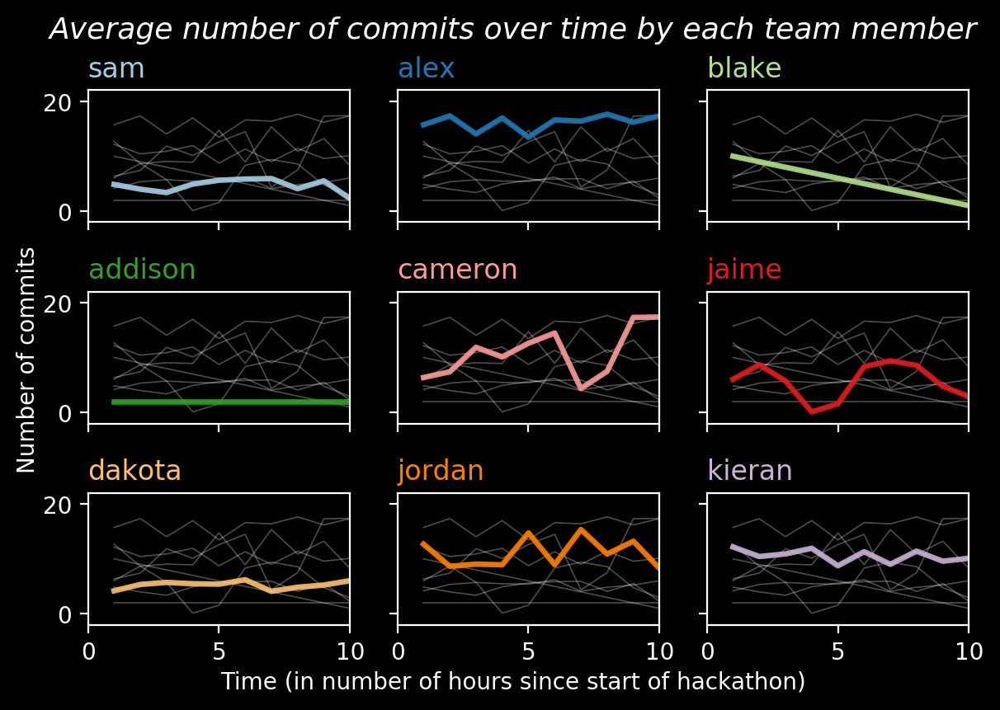

# Small Multiples
----

Created by Cristian E. Nuno

Date: July 17, 2019



## Overview

Small multiples is a visualization technique that partions your data such that you're visualizing one piece of it at a time. These pieces are stored as series of individual plots (i.e. subplots) that share the same x and y-axes. 

Having each subplot on the same scale makes it easier for the reader to compare one subplot to the next without having to mentally account for different scales.

## Goal

For you to be able to create small multiples in python using [`matplotlib`](https://matplotlib.org/3.1.1/gallery/subplots_axes_and_figures/subplots_demo.html).

### Inspiration

This tutorial was inspired by Yan Holtz's [_Small Multiples for Line Charts_](https://python-graph-gallery.com/125-small-multiples-for-line-chart/) tutorial. 


```python
# import necessary libraries
import matplotlib.pyplot as plt
import numpy as np
import pandas as pd
```

Here, each record in `df` represents the average number of commits each team member has over the course of one hackathon. The first record is the average number of commits after the first hour, the second record is the average number of commits after the second hour and so on and so forth.


```python
# create test data
df = pd.DataFrame({"hour": range(1, 11),
                   "sam": np.random.randn(10) + np.random.randint(low=4, high=6, size=10),
                   "alex": np.random.randn(10) + np.random.randint(low=15, high=18, size=10),
                   "blake": list(range(1, 11))[::-1], 
                   "addison": [2] * 10, 
                   "cameron": np.random.randn(10) + np.random.randint(low=1, high=20, size=10),
                   "jaime": np.random.randn(10) + np.random.randint(low=1, high=10, size=10), 
                   "dakota": np.random.randn(10) + np.random.randint(low=5, high=6, size=10),
                   "jordan": np.random.randn(10) + np.random.randint(low=8, high=16, size=10), 
                   "kieran": np.random.randn(10) + np.random.randint(low=9, high=12, size=10)})
df.head()
```

Now we'll do some styling before any creation of the figure and subplots. 

See [here for more information on style sheets](https://matplotlib.org/3.1.1/gallery/style_sheets/style_sheets_reference.html) and [here for information on color maps (i.e. color palettes)](https://matplotlib.org/users/colormaps.html).


```python
# enforce a specific plot style sheet
plt.style.use("dark_background")

# create a color palette
palette = plt.get_cmap("Paired")
```

#### Creating Small Multiples

##### `fig` and `axs`

As seen [in the `matplotlib` documentation](https://matplotlib.org/3.1.1/gallery/subplots_axes_and_figures/subplots_demo.html#stacking-subplots-in-two-directions), we want to create a plot figure that contains a 3X3 grid. Each of the 9 subplots will be accessible by indexing the `axs` object. 

##### Indexing `axs`

To access the subplot in the upper left corner, index `axs` by typing `axs[0, 0]`. You read that as "the subplot in the first row in the first column". 

To access the subplot in the bottom right corner, you type `axs[2, 2]`. You read that as "the subplot in the third row in the third column".

*Always helpful to remember that [Python using zero based indexing](http://python-history.blogspot.com/2013/10/why-python-uses-0-based-indexing.html).*

To avoid manually typing each subplot, we'll access each subplot by using two `for` loops: one for `row` and one for `column`. Additionally, we'll add a value of `1` to the `counter` object after each subplot so that we can highlight one teammate in color.

##### Adding things to the `fig`

Only after the subplots are drawn do we worry about adding elements to `fig`. Here, we'll be creating a title that will be placed in the middle of the figure at the very top. We'll also be adding labels to the x and y-axis. 

Finally, we'll save the figure as a `PNG` file.


```python
# create a figure and a grid of subplots
fig, axs = plt.subplots(nrows=3, ncols=3)

# counter will store the feature index to use when highlighting a particular teammate in each subplot
counter = 0
for row in range(axs.shape[0]):
    for col in range(axs.shape[1]):
        # plot every feature in each subplot in gray color
        for feature in df.drop("hour", axis=1):
            axs[row, col].plot(df["hour"],
                           df[feature],
                           marker="",
                           color="white", 
                           linewidth=0.6,
                           alpha=0.3)
        # for each subplot, plot only one non-"hour" feature - via counter - in color
        # note: we are subsetting each subplot via axs[row, col]
        axs[row, col].plot(df["hour"],
                           df.drop("hour", axis=1).iloc[:, counter],
                           marker="",
                           color=palette(counter), 
                           linewidth=2.4,
                           alpha=0.9)
        # set xlim and ylim for each subplot
        axs[row, col].set_xlim(0,10)
        axs[row, col].set_ylim(-2,22)
        
        # remove x-axis tick marks from the first two rows of subplots
        if row in [0, 1]:
            axs[row, col].tick_params(labelbottom=False)
        # remove the y-axis tick marks from the second and third columns of subplots
        if col in [1, 2]:
            axs[row, col].tick_params(labelleft=False)          

        # assign each subplot a title based on the one non-"hour" feature that was highlighted in color
        axs[row, col].set_title(df.drop("hour", axis=1).iloc[:, counter].name, 
                                loc="left", 
                                fontsize=12, 
                                fontweight=0, 
                                color=palette(counter))
        
        # now that we're done with this subplot, add one to counter so the next teammate is highlighted
        counter += 1
            
# assign an overall title
fig.suptitle("Average number of commits over time by each team member", 
             fontsize=13, 
             fontweight=0,
             color="white", 
             style="italic", 
             y=1.02)
 
# label axes
fig.text(0.5, 0.01, "Time (in number of hours since start of hackathon)", ha="center", va="center")
fig.text(0.01, 0.5, "Number of commits", ha="center", va="center", rotation='vertical')

# adjust layout so things aren't so squished
fig.tight_layout()

# export figure as PNG file
fig.savefig("../visuals/small_multiples_example.png",
            dpi=200,
            bbox_inches = "tight")
```


```python

```
